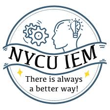

# 🚄 Train Energy Optimization System

An automated simulation system that optimizes train energy consumption while maintaining punctuality through intelligent acceleration/deceleration control strategies.


*Streamlit-based visualization interface showing optimized speed profiles*

## ✨ Key Features

- **Energy-Efficient Driving**: Reduces energy waste from improper acceleration/braking by up to 40%
- **Punctuality Guarantee**: Maintains schedule compliance while optimizing for minimum energy consumption
- **Real-time Simulation**: Interactive Streamlit dashboard for testing different scenarios
- **Multi-Physics Modeling**: Accounts for air resistance, gravity, rolling resistance, and inertia
- **Automated Optimization**: Uses SLSQP algorithm to find optimal speed profiles

## 🛠️ Tech Stack

**Core Technologies:**
- Python 3.8+
- FASTSim & OpenModelica (vehicle modeling)
- SciPy (optimization algorithms)
- Streamlit (web interface)
- Pygame (interactive simulator)

**Key Techniques:**
- Quadratic least squares fitting
- Multi-objective optimization (energy + punctuality)
- Smooth interpolation with distance correction
- Sensitivity analysis & validation

## 📊 Results

**Optimization Performance:**
```
✓ Energy Reduction: ~35-40% vs. unoptimized driving
✓ Schedule Accuracy: ±30 seconds tolerance
✓ Convergence: <5 iterations for typical routes
```

**Sample Output:**
- Time-velocity profiles
- Energy consumption breakdown
- Theoretical minimum validation
- Sensitivity analysis charts

## 🚀 Quick Start

### Installation
```bash
git clone https://github.com/lai20021015/Automobile-energy-consumption-detector.git
cd Automobile-energy-consumption-detector
pip install -r requirements.txt
```

### Run Simulation
```bash
# Launch Streamlit dashboard
streamlit run app.py

# Or run optimizer directly
python optimizer.py --distance 10000 --max_speed 120 --time_limit 600
```

### Basic Usage
```python
from train_optimizer import TrainEnergyOptimizer

# Initialize optimizer
optimizer = TrainEnergyOptimizer(
    distance=10000,  # meters
    max_speed=120,   # km/h
    time_limit=600   # seconds
)

# Run optimization
result = optimizer.optimize()
optimizer.plot_result()
```

## 💡 Core Algorithm

The system uses a **multi-stage optimization approach**:

1. **Speed Profile Generation** (`create_speed_profile`)
   - Flexible parameter-based curve fitting
   - Smooth interpolation with distance correction
   - Handles acceleration/cruise/deceleration phases

2. **Energy Simulation** (`simulate_energy`)
   - Calculates total energy consumption
   - Multi-layer penalty system for constraint violations
   - Comprehensive physics modeling (air drag, rolling resistance, inertia)

3. **Optimization Engine** (`optimize`)
   - SLSQP algorithm for constrained optimization
   - Objective: Minimize energy + penalties
   - Validates solution feasibility

4. **Validation Suite**
   - Theoretical minimum calculation
   - Sensitivity analysis across parameter ranges
   - Solution reasonability checks

## 📁 Project Structure
```
├── src/
│   ├── optimizer.py          # Core optimization logic
│   ├── simulator.py          # Physics simulation
│   └── visualizer.py         # Streamlit interface
├── data/
│   └── taiwan_rail_profiles/ # Real-world speed data
├── app.py                     # Main entry point
└── requirements.txt
```

## 🎯 Future Improvements

- [ ] Real-time train tracking integration
- [ ] Multi-train coordination optimization
- [ ] Machine learning for driver behavior prediction
- [ ] Mobile app for driver assistance

## 📝 Technical Details

**Optimization Constraints:**
- Distance accuracy: ±1%
- Time window: ±30 seconds
- Maximum acceleration: 1.2 m/s²
- Speed limits: Route-specific

**Physics Model:**
- Air resistance: F = 0.5 × ρ × Cd × A × v²
- Rolling resistance: F = Cr × m × g
- Grade resistance: F = m × g × sin(θ)
- Inertia: F = m × a

---

**Note:** This project was developed as part of NYCU Industrial Engineering & Management coursework, focusing on real-world optimization applications in transportation systems.

## 📫 Contact

For questions or collaboration opportunities, feel free to reach out!

---
*Last Updated: December 2024*
